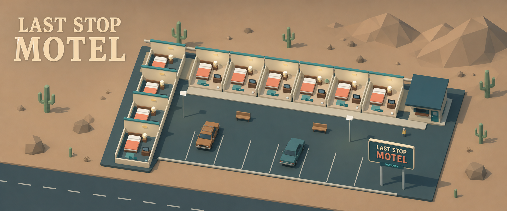

# Last Stop Motel — 1.0.2



A complete, offline, single-player Three.js management game. Inherit a roadside motel, run seven nights, settle the debt, and earn the right to keep the light on.

## Compact mobile layout

Open **Settings → Compact mobile layout** to enable the compact version inside the main game. Switch it off to return to the full layout. The choice is remembered on this browser; no restart or new campaign is required. Compact mode uses four navigation tabs, one panel at a time, lower rendering resolution, no shadows/rain/point lights, and a 30 FPS cap. Your selected audio and standard graphics preferences are preserved.

## Play the release

1. Extract the entire ZIP into a folder.
2. Open `index.html` in a current desktop browser with WebGL 2 enabled.
3. Choose **New campaign**, choose a difficulty, and begin.

Everything needed to play is bundled. You do not need Node, npm, a server, an account, or an internet connection. Keep `index.html` and `assets/` together. The application uses a classic bundled script so it can launch from a local file.

On phones and tablets, use the game from a static web host. iOS Files previews do not provide a reliable environment for local HTML games. This release includes touch controls and a portrait layout, but has not been playtested on physical devices.

For itch.io, upload this ZIP as an HTML game, choose **This file will be played in the browser**, and enable fullscreen. The ZIP has `index.html` at its root. A starting embed size of 1280 × 800 works with the responsive layout; allow mobile players to use fullscreen. No hosting action is required for desktop offline play.

## Complete release content

- Seven authored campaign chapters, 14 story decisions, three difficulty settings, success/failure endings, and unlocked endless play.
- Ten modeled rooms: six open initially and four in the west wing to restore.
- Ten traveler archetypes with budgets, comfort preferences, quiet-room needs, patience, happiness, and tips.
- Cleaning, condition, repairs, guest requests, immediate supply deliveries, emergency financing, and nightly accounting.
- Three staff roles with automatic task assignment and shift wages.
- Three renovation levels per room and six functional property improvements, with corresponding scenery changes where appropriate.
- Interactive Three.js property, camera rotation and zoom, room picking, occupants, staff movement, cars, rain, night lighting, and visible room states.
- Original synthesized background music and sound effects; volume, mute, motion, graphics, and automatic pause settings.
- Automatic local saves, a previous-save recovery copy, validated import/export, achievements, a guide, and credits.
- Complete readable source, pinned dependencies, build tools, and automated tests.

## The objective

Finish night seven with cash at least equal to your outstanding debt and reputation of at least 40. The debt is paid automatically at the final sunrise. In endless mode, supplier credit is paid with the next night's bills.

| Difficulty | Starting cash | Starting debt | Behavior |
| --- | ---: | ---: | --- |
| Scenic route | $1,000 | $1,700 | Patient guests, slower wear |
| The long week | $750 | $2,300 | Intended campaign balance |
| Against the odds | $650 | $2,900 | Less patience, faster wear |

A night covers 18:00–02:00, then jumps to sunrise. At 1×, each real second advances three game minutes. Speeds are 1×, 3×, and 6×. Decisions and menus pause the clock. Arrival pauses are enabled by default. Preparation advances tasks without advancing the night.

## Controls

- Click/tap a room, or select it from **Rooms**.
- Select a traveler in **Reception**, select a ready affordable room, then confirm the check-in.
- **Find best room** selects the affordable room with the highest expected happiness. It does not book without confirmation.
- Drag the property to rotate. Scroll/pinch to zoom. Onscreen camera controls offer the same actions.
- Space: pause/resume. 1/2/3: speed. R: room list. H: guide. Escape: close an ordinary menu or room panel.
- Native button and input keyboard behavior takes priority when a control has focus.

## Save files

Progress is saved in this browser on this device. Changes of browser, host, file location, or browser data may make an existing local save unavailable. Export a JSON backup from **Settings** when you want to move it. Imported files are validated before replacing the current game. A corrupted current automatic save can fall back to the previous automatic copy.

Settings and remembered achievements are browser-local; the exported campaign carries the achievements earned during that campaign, not the complete history of every other campaign.

No data is sent to any service. There are no analytics, external fonts, advertisements, or network calls from the game.

## Source and rebuild

The downloadable ZIP includes the development project in `SOURCE/`. Its `dist/` directory contains the exact playable files. In `SOURCE/`, with a current Node.js installation:

```text
npm ci
npm run build
npm test
npm run package
```

`npm ci` needs internet access to fetch the pinned development dependencies. Playing the prebuilt game does not.

- `src/engine.js`: deterministic game state, jobs, finances, campaign, save validation.
- `src/content.js`: guests, chapters, events, staff, upgrades, achievements.
- `src/scene.js`: Three.js scenery, interaction, and animation.
- `src/main.js`: interface, settings, saving, menus, and main loop.
- `src/audio.js`: synthesized score and effects.
- `dist/assets/style.css`: responsive interface styling.
- `tools/build.mjs`: self-contained classic-script bundle.
- `tests/`: campaign and release integrity checks.

## Validation and scope

See `RELEASE-NOTES.md` for the final automated results. Checks cover complete campaign simulations, meaningful loss and win paths, endless continuation, room jobs, staff wages, purchases, guest consequences, story affordability, save restoration and rejection, and offline release structure.

See `CHANGELOG.md` for the detailed project, package, and hotfix history.

This is a self-contained 1.0 game with no placeholder features or planned dependencies required to finish it. Automated simulation is not human playtesting: the manual layout toggle was browser-tested, while 3D rendering and physical-device performance were not verified in this environment. Use the low graphics setting on constrained devices. If WebGL 2 is unavailable, the room register preserves access to gameplay while explaining that the 3D view could not start.

Three.js is included under its MIT license in `THREE-LICENSE.txt`. No third-party art, audio recordings, or web fonts are used.
